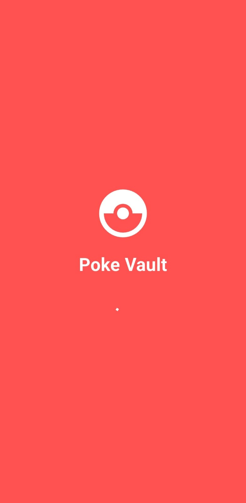
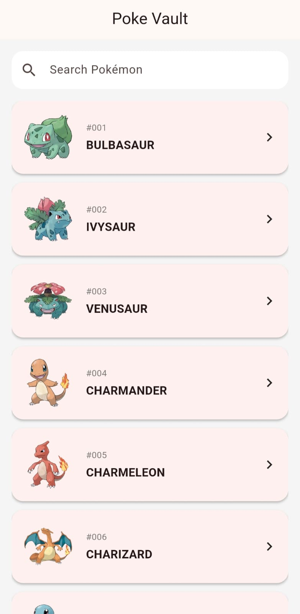

# Poke Vault

Poke Vault adalah aplikasi Flutter yang menampilkan daftar Pokémon menggunakan **PokeAPI**.  
Aplikasi ini dibuat sebagai **technical assessment Flutter Developer** dengan fokus pada arsitektur bersih, state management, offline storage, dan testing.

---

## Developer

**Dwi Ifan Ramadhan**

---

---

# App Preview

  
  

---

## Requirement

Sebelum menjalankan aplikasi, pastikan environment berikut tersedia:

- Flutter SDK
- Dart SDK
- Android Studio / VS Code
- Emulator Android

⚠️ **Emulator harus menggunakan Android API 33 atau lebih tinggi**

---

# Setup Instructions

Ikuti langkah berikut untuk menjalankan project.

## 1. Clone Repository

- git clone https://github.com/yourusername/pokemon_app.git

Masuk ke folder project:
- cd pokemon_app

---

## 2. Install Dependencies
- flutter pub get

---

## 3. Run Application

Pastikan emulator menggunakan **API 33+**
- flutter run

---

## 4. Generate App Icon (Optional)

Jika ingin generate ulang icon aplikasi:
- dart run flutter_launcher_icons

---

# Running Tests

Menjalankan test:
- flutter test test/presentation/providers/pokemon_list_provider_test.dart

---

# Architecture

Project ini menggunakan **Layered Architecture** 

---

# Architectural Decisions

## 1. Layered Architecture

Aplikasi ini menggunakan **Layered Architecture** agar kode lebih mudah dipelihara dan scalable.

Layer yang digunakan:

### Core
Berisi utilitas global seperti:

- API constants
- Hive service
- Utility helper

---

### Data Layer

Bertanggung jawab terhadap pengambilan dan penyimpanan data.

Komponen:

- Remote datasource (API)
- Local datasource (Hive)
- Models
- Repository implementation

---

### Domain Layer

Berisi **business logic** aplikasi.

Komponen:

- Entities
- Repository abstraction
- Usecases

Layer ini tidak bergantung pada framework.

---

### Presentation Layer

Berisi UI dan state management.

Komponen:

- Pages
- Widgets
- Providers

State management menggunakan **Provider (ChangeNotifier)**.

---

# State Management

Aplikasi menggunakan **Provider** karena:

- sederhana
- ringan
- cocok untuk skala aplikasi kecil sampai menengah
- mudah diintegrasikan dengan Flutter

Provider yang digunakan:
    PokemonListProvider
    PokemonDetailProvider

---

# Networking

Networking menggunakan package:
- http

API yang digunakan:
- https://pokeapi.co

---

# Project Highlights

Beberapa hal yang menjadi fokus implementasi project:

- Clean Architecture
- Separation of Concerns
- State Management
- Pagination
- Offline Cache
- Unit Testing

---

# Notes

Project ini dibuat sebagai bagian dari **Flutter Developer Technical Assessment**.

Fokus utama dari implementasi adalah:

- Code readability
- Architecture
- Error handling
- Offline support
- Testing